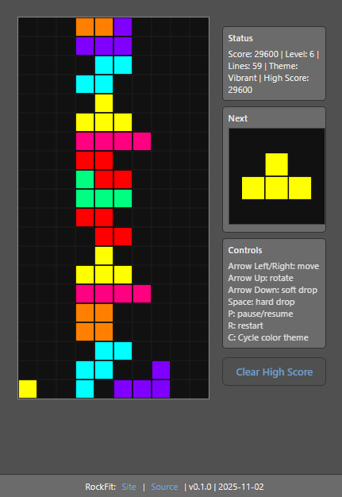

# RockFit (Falling Blocks Game)

A friendly falling-blocks game built with TypeScript and HTML5 Canvas.
Installable as a Progressive Web App (PWA).

Initial Features:

- 10x20 grid
- 7 generic piece types
- Rotation (90 degrees with simple wall kicks)
- Line clears, scoring and level speed-up
- Pause and restart
- Installable on a device - it's a progressive web app (PWA)

## Controls

You can play **RockFit** using a keyboard or by tapping on-screen buttons (on phones and tablets).

### Keyboard Controls

| Key          | Action         |
| ------------ | -------------- |
| Left / Right | Move piece     |
| Up           | Rotate piece   |
| Down         | Soft drop      |
| Space        | Hard drop      |
| P            | Pause / Resume |
| R            | Restart game   |

### Touch Controls (Mobile & Tablet)

When opened on a phone or tablet, **RockFit** shows a touch bar along the bottom of the screen with large, easy-to-tap buttons:

| Button | Action                       |
| ------ | ---------------------------- |
| ⬅️     | Move left                    |
| ➡️     | Move right                   |
| ⬆️     | Rotate piece                 |
| ⬇️     | Soft drop (move down slowly) |
| ⏬     | Hard drop (instant)          |
| ⏸️     | Pause                        |
| ▶️     | Resume                       |
| 🔄     | Restart game                 |

> The touch bar hides automatically on large screens but always appears on mobile.
> You can modify its look and feel in `index.css` under **“Touch controls (mobile)”**.

> **Play on mobile:**
> RockFit is installable as a Progressive Web App (PWA).
> On Android (Chrome) or iOS (Safari), tap **“Add to Home Screen”** to install and play full-screen.

## How the Game Logic is Organized

The main code is in the [`src`](./src/) folder. For an overview, see: [`SRC.md`](./SRC.md)

## Making Changes

To make changes, see: [`CONTRIBUTING.md`](./CONTRIBUTING.md).

